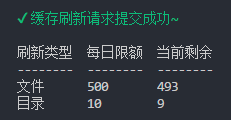

# qiniu-cache-refresh

基于配置的七牛缓存刷新命令行工具。



## 安装

```bash
yarn add qiniu-cache-refresh -D

// 或者

npm i qiniu-cache-refresh -D
```

## 用法

### 配置

在项目根目录下新建 `qiniu.config.js` 文件，写入配置：

```js
module.exports = {
  accessKey: 'Access 密钥',
  secretKey: 'Secret 密钥',
  cacheRefresh: {
    urls: [
      'https://foo.bar/about.html',
      'https://foo.bar/sitemap.html'
      // 更多 url
    ],
    dirs: [
      'https://foo.bar/images',
      'https://foo.bar/pages'
      // 更多目录
    ]
  }
}
```

### 使用

```bash
yarn qiniu-cache-refresh

// 或者

npx qiniu-cache-refresh
```

在 `package.json` 中你可以这么使用：

```json
{
  "scripts": {
    "deploy:qiniu": "qiniu-cache-refresh"
  }
}
```
